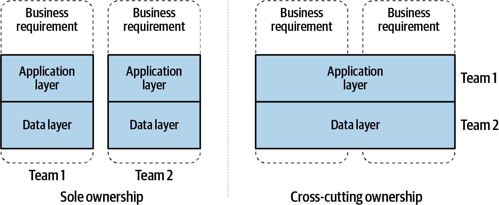

# 1장. 왜 이벤트 기반 마이크로서비스인가?

## 1.1. 이벤트 기반 마이크로서비스란?
- 서비스 지향 아키텍처(SOA)
  - 서로 직접 비동기 통신하는 여러 마이크로서비스로 구성
  - 메시지 전달 아키텍처도 소비 가능한 이벤트를 주고 받으며 서로 비동기 통신
- 현대의 이벤트 기반 마이크로서비스 아키텍처
  - 시스템이 이벤트를 생산/소비하는 식으로 서로 통신
  - 이벤트를 소비한 이후에도 같은 메시지를 필요로 하는 다른 컨슈머도 가져갈 수 있게 보존된다.

## 1.2. 도메인 주도 설계와 Bounded Context
- 도메인 주도 설계
  - 도메인
  - 하위 도메인
  - 도메인 모델
  - Bounded Context
- 하위 도메인을 중심으로 형성되어 마이크로 서비스가 탄생하는 기초

- 비즈니스 요건에 의존
  - High Cohesion, Loose Coupling 
- 기술요건에 의존
  - 비즈니스를 수행할 책임이 분산됨

## 1.3. 통신 구조
- 시스템 구조는 그 시스템을 설계하는 조직의 통신 구조를 그대로 따라갈 수 밖에 없다. - Melvin Conway

### 기존 컴퓨팅의 통신 구조
- 단일 Data Store에 기반한 단일 서비스의 경우
  - 새로운 비즈니스 구현
    - 신규 서비스 구축 vs 기존 서비스에 추가
    - 신규 시스템의 오버헤드 vs 복잡해지는 서비스
  - 서비스가 더욱 커질 경우 부담감 증가
  - 분리가 어려운 이유 : 구현 통신 구조간 데이터 통신 수단이 취약하고 제대로 정의되지 않음
### 이벤트 기반 통신 구조
- 차이점
  - 데이터에 접근하는 행위가 철저히 분리되기 때문에 직접 요청-응답하는 API가 제한됨
  - 이벤트 스트림 내부에 정의된 이벤트 데이터를 매개로 소통한다.
  - 프로듀서는 자신이 맡은 이벤트 스트림에 잘 정의된 데이터를 생산하는 일만 책임지면 된다.
  - 이벤트 = 데이터
- 컨슈머가 스스로 모델링과 쿼리를 수행
- High Cohesion, Loose Coupling
- 비즈니스 통신 변경 가능

## 1.4. 비동기식 이벤트 기반 마이크로서비스
- 장점
  - 세분성
    - 비즈니스 요건이 변경되어도 쉽게 재작성 가능
  - 확장성
  - 기술 유연성
  - 비즈니스 요건 유용성
  - High Cohesion, Loose Coupling

## 1.5. 동기식 마이크로서비스
- 요청-응답 API
- 장점
  - 인증, 연계 테스트 유용
  - 트레이싱에도 용이, 높은 가시성
- 단점
  - 점대점 결합
  - 의존적 확장
  - 디펜던시 관리
  - Failover
  - 분산 모놀리스
  - 테스트