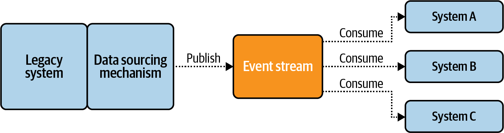

# 4장. 기존 시스템에 이벤트 기반 아키텍처 통합
- 신규 프로젝트가 아닌 레거시 시스템의 아키텍처 변화를 위한 방법
## 4.1. 데이터 해방
- cross-domain data set를 식별해 각 이벤트 스트림에 발행하는 이벤트기반 아키텍처의 마이그레이션 전략중 하나

- 데이터 해방과 구체화
  - 데이터 저장소에서 데이터를 꺼내고 필요한 이벤트 스트림을 생성
  - 이벤트 데이터 발행을 엄격하게 통제함으로써 내부 데이터 세트를 외부 이벤트 스트림과 계속 동기화 -> 데이터 동기화
    비즈니스 연관성이 많고, 자주 사용하는 데이터 순서대로 해방

## 4.2. 데이터 해방 프레임워크

- Kafka Connect, Apache Gobblin, Apache NiFi 와 같은 중앙화 프레임워크 사용
- 안티패턴 우려

## 4.3. 데이터 해방 패턴

### 4.3.1. 쿼리 기반
- 데이터를 대량조회한 후 주기적으로 업데이트해 변경분을 출력 이벤트 스트림에 생성
- 이전 쿼리 결과의 최종 타임스탬프 이후에 쌓인 데이터를 쿼리해서 적재 
- 장점
  - 모든 데이터 저장소를 한번에 쿼리 가능
- 단점
  - hard delete는 쿼리 결과에서 드러나지 않기 떄문에 soft delete만 가능
  - 대량의 쿼리를 실행해 시스템의 지연시간이 커질 수 있음
  - 오랜 쿼리시간으로 인해 경합조건 발생 가능

### 4.3.2. CDC 기반
- 시간 경과에 따라 데이터 세트에 발생한 모든 일이 저장된 로그를 활용
  
- 바이너리 로그 추적
- 하부 데이터 구조의 변경 내역을 기록한 붙임 전용 로그를 기준으로 데이터 추출
- 데이터 변경 로그를 보관하는 데이터 저장소에서만 가능한 방법
- 장점
  - hard delete 확인 가능
  - 데이터 저장소에 영향도 X
  - low-latency
- 단점
  - 내부 데이터 모델 노출
  - 정규화 X
  - 데이터 저장소의 변경 발생시 호환성이 어긋날 가능성

### 4.3.3. 아웃박스 테이블 기반
- CDC 대상으로 표시된 데이터 저장소에서 테이블 레코드가 삽입, 수정, 삭제될 때마다 해당 레코드가 아웃박스 테이블에 발생
- 장점
  - 트랜잭션을 지원하는 클라이언트나 프레임워크는 전부 사용 가능
  - 저장에 필요한 필드만 추출 가능
  - 반정규화 가능
- 단점
  - 어플리케이션 코드 변경 필수
  - 비즈니스 워크플로우에 영향
  - 데이터 저장소의 성능에 영향

### 4.3.4. 데이터 정의 변경을 캡처 대상 데이터 세트로
- 쿼리 패턴, CDC 로그 패턴
  - 쿼리 시점에 스키마를 가져와 추론
  - 데이터 정의 변경을 로그에서 추출해 데이터 세트의 스키마 표현형으로 추론
    - Debezium Connector는 MySQL의 데이터 정의 변경만 지원
- 변경-데이터 테이블 캡쳐 패턴
  - 내부 상태 스키마와 출력 이벤트 스트림을 관리하는 테이블 생성

### 4.3.5. 이벤트 데이터를 데이터 저장소에 싱킹
- 이벤트 데이터를 소비해서 데이터 저장소에 삽입하는 싱킹을 수행
- 어떤 유형의 데이터라도 데이터 저장소에 저장할 수 있음